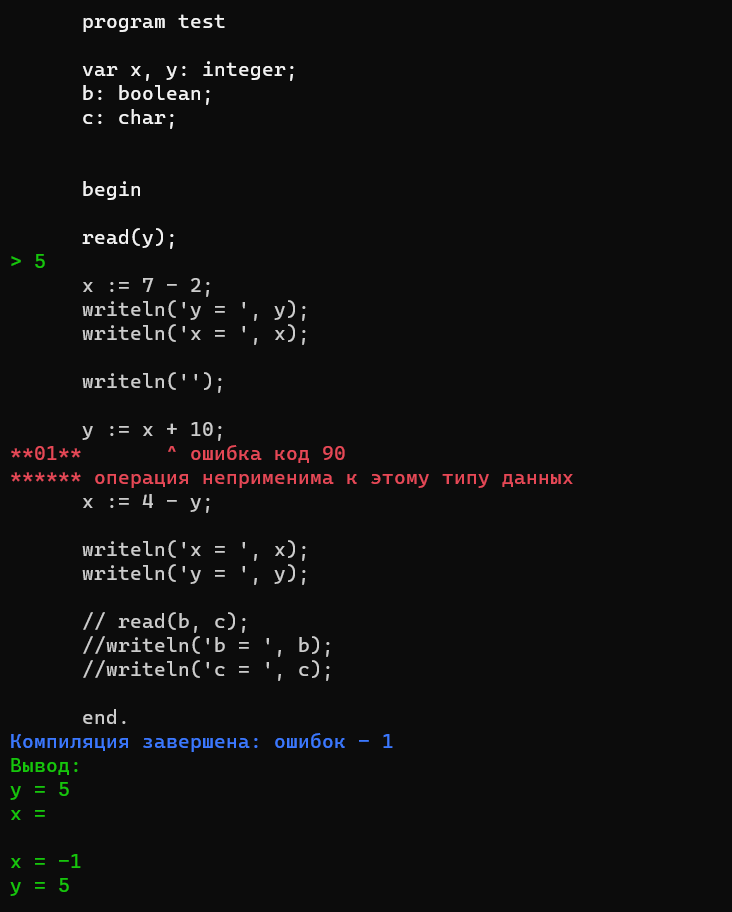

# Pascal-compiler

Данный проект - это компилятор для языка Паскаль, разработанный на C# в рамках лабораторной работы по предмету "Языки программирования".

## Использование
1. [Скачайте данный репозиторий](https://github.com/Lagertt/Pascal-compiler/archive/refs/heads/main.zip)
2. Перейдите в папку TxtFiles
3. В ней вставьте свой код на языке Паскаль в файл Program.txt и сохраните результат
4. Затем перейдите в папку "..\bin\Debug\net5.0\" и запустите файл Compiler.exe

## Поддерживаемый функционал
Т.к. реализовывать полный компилятор достаточно долго и трудозатратно, мы выполняли работу по вариантам, соответственно в данном проекте присутствует анализ не всех языковых конструкция языка. Вот те, что поддерживаются (были в моём варианте):
- описание переменных простых типов
- описание массивов
- операторы присваивания (для простых и индексированных переменных)
- составной оператор

Также есть реализация ввода и вывода с клавиатуры, но без синтаксического и семантического анализа, т.к. это часть нужна была лишь для проверки правильности работы модуля генерации кода и работы таблицы идентификаторов и типов
